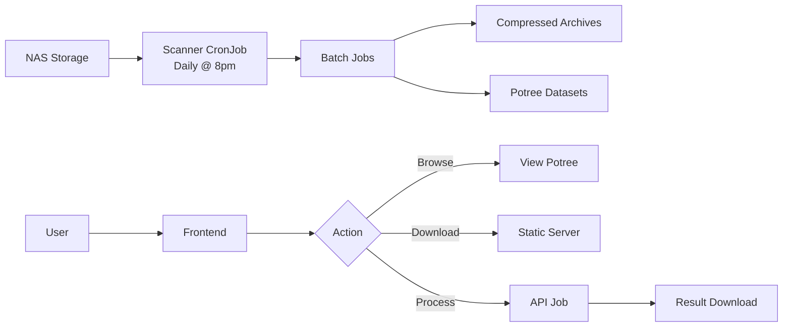

# AddLidar

A web-based platform for storing, processing, and visualizing LiDAR datasets from airborne missions. Built for EPFL's CRYOS laboratory.

**🌐 Platform URLs:**

- **Dev:** [https://addlidar-dev.epfl.ch/](https://addlidar-dev.epfl.ch/)
- **Prod:** [https://addlidar.epfl.ch/](https://addlidar.epfl.ch/)
- **Stage:** [https://addlidar-stage.epfl.ch/](https://addlidar-stage.epfl.ch/)

## Table of Contents

- [Project Structure](#project-structure)
- [System Overview](#system-overview)
- [Development](#development)
- [Deployment](#deployment)
- [Contributing](#contributing)

## Project Structure

```
AddLidar/
├── backend/
│   ├── lidar-api/              # FastAPI service
│   │   ├── app/                # API application
│   │   ├── data/               # SQLite database
│   │   └── Makefile            # Dev commands
│   └── LidarDataManager/       # Processing CLI tool
│
├── frontend/                    # Vue.js + Potree viewer
│   ├── vueSrc/                 # Vue 3 + Quasar app
│   ├── src/                    # Potree source
│   └── libs/                   # Potree libraries
│
├── scanner/                     # Automated data detection
│   ├── scanner.py              # Folder scanning logic
│   └── job-batch-*.template.yaml
│
├── compression/                 # Archive creation tool
│   └── archive.py              # Parallel compression (pigz)
│
├── potree-converter/           # Web optimization tool
│   └── entrypoint.sh           # Conversion wrapper
│
└── docs/                       # Documentation
```

### Component Overview

**backend/lidar-api**
FastAPI service that manages processing jobs via Kubernetes. Provides REST API, WebSocket updates, and SQLite database for job tracking.

**backend/LidarDataManager**
CLI tool that runs inside Kubernetes jobs to filter, transform, and export LiDAR point clouds.

**frontend**
Vue.js single-page application with embedded Potree 3D viewer. Allows users to browse datasets, visualize point clouds, and submit custom processing requests.

**scanner**
Python service that runs as a CronJob (daily @ 8pm) to detect new LiDAR data on NAS storage and create batch processing jobs.

**compression**
Containerized worker using pigz for parallel compression. Runs as Kubernetes batch jobs (4 workers) to create tar.gz archives.

**potree-converter**
Docker wrapper for PotreeConverter that generates web-optimized octree structures from `.metacloud` files. Runs as Kubernetes batch jobs (2 workers).

## System Overview

### Architecture

Three main services deployed on Kubernetes:

1. **Backend API** - FastAPI + SQLite + K8s job orchestration
2. **Frontend** - Vue.js + Quasar + Potree 3D viewer
3. **Static Server** - Nginx serving compressed archives

### Data Flow



### Automated Processing

- **Scanner CronJob**: Detects new folders using fingerprints, creates batch jobs
- **Compression Jobs**: 4 parallel workers compress folders to tar.gz
- **Potree Jobs**: 2 parallel workers convert `.metacloud` to octree format
- **Cleanup CronJob**: Removes temp files older than 12h (Sunday midnight)

### Storage

- **fts-addlidar PVC**: NAS mount for raw data and processed files
  - `/LiDAR`: Original datasets
  - `/LiDAR-Zips`: Compressed archives
  - `/Potree`: Web-optimized datasets
- **lidardatamanager-output PVC**: Temporary processing outputs (100Gi)
- **database PVC**: SQLite for job tracking (1Gi)

### Routing

```
addlidar.epfl.ch/
├── /api/*      → Backend API
├── /static/*   → Static file server
└── /*          → Frontend SPA
```

## Development

### Prerequisites

- Node.js 20+
- Python 3.9+
- Docker
- Kubernetes cluster access (optional)

### Backend

```bash
cd backend/lidar-api

# Install dependencies
make install

# Run dev server
make dev

# Format & lint
make format
make lint

# Database management
make db-status          # Check all environments
make db-push-dev        # Push to dev
make db-pull-prod       # Pull from prod
```

### Frontend

```bash
cd frontend

# Install and run
npm install
npm run dev             # Starts on port 9000

# Build
npm run build
```

### Scanner

```bash
cd scanner

# Build image
docker build -t addlidar-scanner .

# Test locally (dry-run)
python scanner.py --export-only
```

### Git Hooks

```bash
# Set up automatic format/lint on commit
make setup-hooks

# Skip hooks if needed
git commit --no-verify
```

## Deployment

The platform is deployed on Kubernetes with three environments managed via Kustomize:

- **dev**: `epfl-eso-addlidar-dev`
- **prod**: `epfl-eso-addlidar-prod`
- **rcp-haas**: `epfl-eso-addlidar-rcp-haas` (high-performance nodes)

### Key Resources

**Deployments:**

- backend: FastAPI (500m-1 CPU, 256Mi-2Gi memory)
- frontend: Vue.js SPA (50m-1 CPU, 128Mi-2Gi memory)
- static-files: Nginx (50m-1 CPU, 128Mi-2Gi memory)

**CronJobs:**

- scanner: Daily @ 8pm (`0 20 * * *`)
- file-cleanup: Sunday midnight (`0 0 * * 0`)

**Limits:**

- Max 16 jobs per namespace
- Max 30 pods per namespace
- Job TTL: 2 hours after completion
- Temp file cleanup: 12 hours

### Environment Variables

Backend (`.env`):

```bash
ENVIRONMENT=development
IMAGE_NAME=ghcr.io/epfl-enac/lidardatamanager
IMAGE_TAG=latest
NAMESPACE=epfl-eso-addlidar-dev
PVC_NAME=fts-addlidar
PVC_OUTPUT_NAME=lidardatamanager-output
OUTPUT_PATH=/output
DATABASE_PATH=/data/database.sqlite
```

**Report Issues:** [GitHub Issues](https://github.com/EPFL-ENAC/AddLidar/issues)

## Contributors

- **EPFL CRYOS** - Jan Skaloud (Research & Data)
- **EPFL ENAC-IT4R** - Implementation and Project Management

## License

This project is licensed under the [GNU General Public License v3.0](LICENSE).

---

**Status**: Under active development  
**Support**: Contact EPFL ENAC-IT4R team
